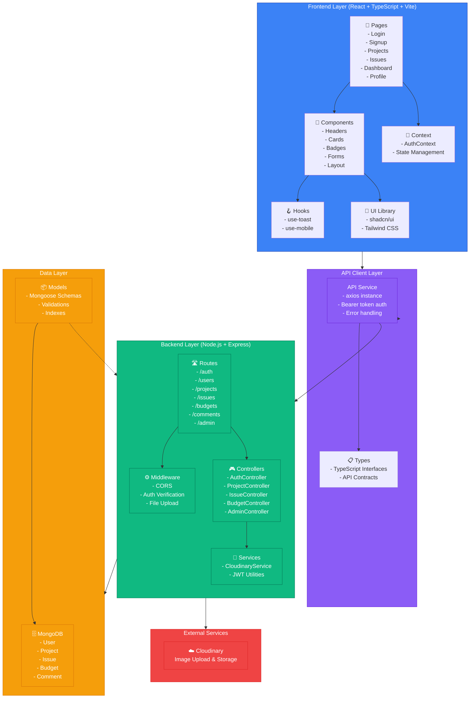

# Civic Fusion - System Architecture

## Overview

Civic Fusion is a full-stack web application built with a modern, scalable architecture. The application follows a **3-tier architecture** with a separate API layer, organized by concerns and best practices.

## System Architecture Diagram

## Architecture Layers

### 1. **Frontend Layer** (React + TypeScript + Vite)

**Purpose:** User-facing interface for all civic engagement features

**Components:**
- **Pages:** Main route components (Login, Signup, Projects, Issues, AdminDashboard, Profile)
- **Components:** Reusable UI elements (Headers, Cards, Badges, Forms, Layouts)
- **Context API:** Global state management with AuthContext
- **Custom Hooks:** Utility hooks for toasts and responsive design
- **UI Library:** shadcn/ui components with Tailwind CSS styling

**Key Features:**
- Type-safe with TypeScript
- Responsive design with Tailwind CSS
- Protected routes for authenticated users
- Toast notifications for user feedback

### 2. **API Client Layer**

**Purpose:** Abstract HTTP communication and provide type-safe API contracts

**Components:**
- **API Service:** Centralized axios instance with:
  - Bearer token authentication
  - Automatic error handling and 401 redirects
  - Consistent request/response formatting
- **Types:** TypeScript interfaces defining API contracts for all entities

**Key Features:**
- Automatic token injection on all requests
- Request logging and debugging
- Environment-based API URL configuration

### 3. **Backend Layer** (Node.js + Express)

**Purpose:** Business logic and data processing

**Components:**

- **Routes:** REST API endpoints organized by feature
  - Authentication (/auth)
  - User management (/users)
  - Project management (/projects)
  - Issue tracking (/issues)
  - Budget management (/budgets)
  - Comments (/comments)
  - Admin operations (/admin)

- **Middleware:** Request processing and validation
  - CORS for cross-origin requests
  - Authentication verification
  - File upload handling

- **Controllers:** Request handlers and business logic
  - Validate incoming data
  - Interact with models
  - Call services
  - Return formatted responses

- **Services:** Reusable business logic
  - Cloudinary integration for image uploads
  - JWT token generation and verification

### 4. **Data Layer** (MongoDB + Mongoose)

**Purpose:** Data persistence and validation

**Components:**
- **Models:** Mongoose schemas for all entities
  - Pre-validation on all fields
  - Custom middleware for data transformation (password hashing)
  - Indexes for query optimization
  - Relationships via ObjectId references

- **Collections:**
  - User (with role-based access)
  - Project (with progress tracking)
  - Issue (with response threads)
  - Budget (with spending history)
  - Comment (with soft delete support)

### 5. **External Services**

- **Cloudinary:** Image upload and storage for project progress images

## Data Flow

1. **User Action** → React component triggers
2. **API Call** → Frontend makes HTTP request with authenticated headers
3. **Route Matching** → Express routes request to appropriate controller
4. **Authentication** → Middleware verifies JWT token
5. **Business Logic** → Controller processes request and calls services
6. **Database Query** → Mongoose models interact with MongoDB
7. **Response** → JSON response returns to frontend
8. **State Update** → React updates UI based on response

## Technology Stack

| Layer | Technology | Purpose |
|-------|-----------|---------|
| **Frontend** | React 18 | UI framework |
| | TypeScript | Type safety |
| | Vite | Build tool |
| | Tailwind CSS | Styling |
| | shadcn/ui | Component library |
| **Backend** | Node.js | Runtime |
| | Express.js | Web framework |
| | Mongoose | ODM |
| **Database** | MongoDB | NoSQL database |
| **External** | Cloudinary | Image storage |

## Security Features

- **Authentication:** JWT tokens with Bearer scheme
- **Authorization:** Role-based access control (citizen, volunteer, official, admin)
- **Password Security:** bcryptjs for password hashing
- **Input Validation:** Mongoose schema validation
- **CORS:** Configured for secure cross-origin requests
- **Error Handling:** Consistent error formatting without exposing internals

## Scalability Considerations

- **Stateless Backend:** Can be horizontally scaled
- **Database Indexes:** Optimized queries on frequently filtered fields
- **External Storage:** Cloudinary handles image delivery and CDN
- **Separation of Concerns:** Each layer has distinct responsibilities
- **Type Safety:** TypeScript prevents runtime errors
