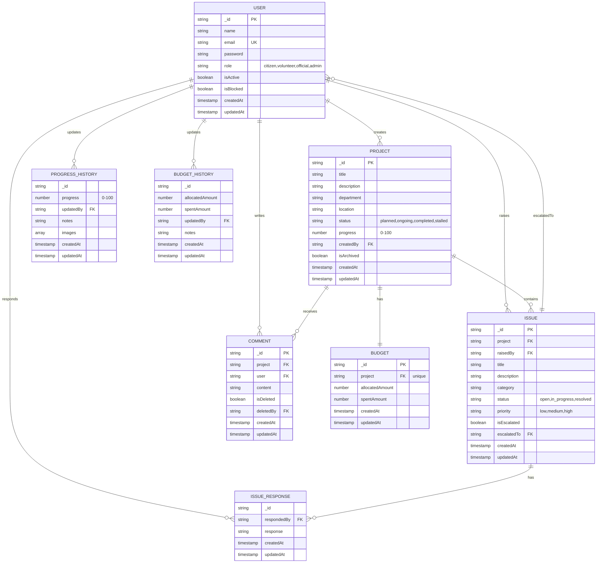

# Civic Fusion - Database ER Diagram

## Entity Relationship Diagram

## Key Relationships

- **USER** (Central Entity)
  - Roles: citizen, volunteer, official, admin
  - Can create projects, raise issues, write comments
  - Track updates to progress and budget history

- **PROJECT**
  - Created by users
  - Has one-to-one relationship with Budget
  - Contains multiple issues and comments
  - Tracks progress history

- **ISSUE**
  - Belongs to a project
  - Raised by users
  - Can have multiple responses
  - Can be escalated to specific users
  - Statuses: open, in_progress, resolved
  - Priorities: low, medium, high

- **BUDGET**
  - One-to-one relationship with Project
  - Tracks allocated and spent amounts
  - Maintains history of budget changes

- **COMMENT**
  - Links users to projects for discussions
  - Supports soft delete (marked as deleted)
  - Ordered by creation time

- **Embedded Schemas** (stored within documents)
  - Progress History: Tracks project progress updates with images
  - Budget History: Tracks budget allocation and spending changes
  - Issue Responses: Tracks responses to issues
